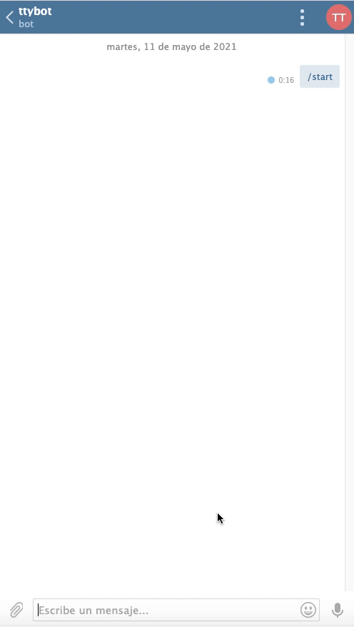

# TTYgram

A simple but yet effective terminal Telegram bot.



## Why?

I just wanted to monitor my server temperature and basic statistics from Telegram but I ended up overengineering the initial idea. I though it would be useful and cool being able to execute commands and scripts remotely as well. 

Although being far from a completely functional shell I find it quite useful!
## Specs and how it works

#### Execute commands
Theoretically any command can be executed, but with some restrictions. Commands are executed in a sandboxed process using `subprocess` python module. Commands are thrown to standard `sh` shell and once they have been executed, the process exits. Some made workarounds:

Some commands may output a large text to `stdout`, in this case, since Telegram API has a max length message restriction, a warning message is displayed. Also, some commands like `ping google.com` may never exit. Launched subprocess has been configured with a timeout of `2 seconds` to avoid locks in situations like this since command output can only be readen once it has exited.

Some additional tweaks may need to be done in order to match your requirements.

#### Change dir
As I have mentioned, since commands are launched in a temporary shell which exits after execution, some commands like `cd` won't work. For this reason this feature has been implemented as an option: `chdir`. It uses `os.chdir(path)` which will change parent's `current work directory`.

#### Monitor your system status
⚠️ This has only been tested in Ubuntu Server and this option is only available for Linux systems.

#### Chat Id
Get your chat id for authentication purposes. Read bellow.

## Usage

#### 1. Register
Register a new bot with `BotFather` bot in Telegram. Copy `TOKEN`.

#### 2. Add token
```bash
    export TTYGRAM_TOKEN='your_token'
```
#### 3. Start bot
```bash
    cd ttygram && python3 bot/main.py
```

#### 3. Authenticate
Since Telegram bots are public once published and you may not want anybody poking around in your system, a simle and stupid "authentication" method has been added. Because Telegram chats have a unique id, we will use this id to enable conversations only between your bot and you and nobody else.

So open your bot, select chat_id option in bot, get your conversation id and export it:
```bash
    export TTYGRAM_CHAT_ID='your_chat_id'
```

## Dependencies

This project has been built using [python_telegram_bot](https://github.com/python-telegram-bot/python-telegram-bot.git). Follow their installation instructinos.

Also, you may have to install `Python3`

## Support

If you find any issue I suggest that you open a PR with the fix 🙂
